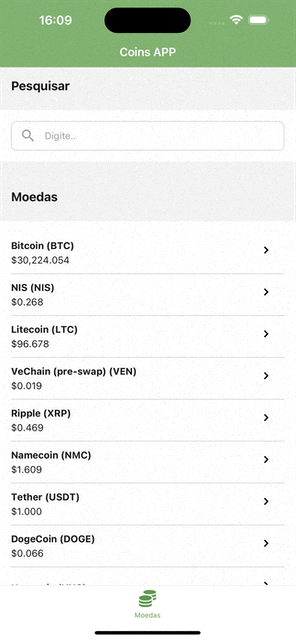

## Motivo
Integrar uma API NodeJS e um APP Mobile React Native (Expo) ao NX. E compartilhar code style e contratos de tipos (interfaces).




##  Pré requisitos
 - Git ([https://git-scm.com/](https://git-scm.com/))
 - NodeJS ([https://nodejs.org](https://nodejs.org/))

## Api: CoinAPI
É necessário obter sua **Api Key** para ter acesso aos recursos, pra isso acesse o site da [CoinApi](https://www.coinapi.io/market-data-api/pricing) e clique em "Get a free api key", preencha o formulário e sua Api Key será enviada para o e-mail informado.

## Clonando o repositório
Com o Git e o NodeJS instalado na sua máquina digite os comandos abaixo:

```
git clone https://github.com/bmenegidio/coins-app.git
cd coins-app
npm install
```

## Variáveis de ambiente
No projeto existem dois arquivos de exemplo `/coins-app/apps/coins-api/.env.example` e `/coins-app/apps/coins-app/.env.example`, basta copiar os arquivos, renomear para `.env` e substituir os valores.

## Executando a API
```
npx nx run coins-api:serve --configuration=development
```

## Executando o APP
```
npx nx run coins-app:start
    
#  Após finalizar o comando acima, aperte "i" para executar no iOS o "a" para executar no android.
```

## Testes
Para executar os testes unitários da API, rode o comando abaixo:
```
npx nx test coins-api
```
